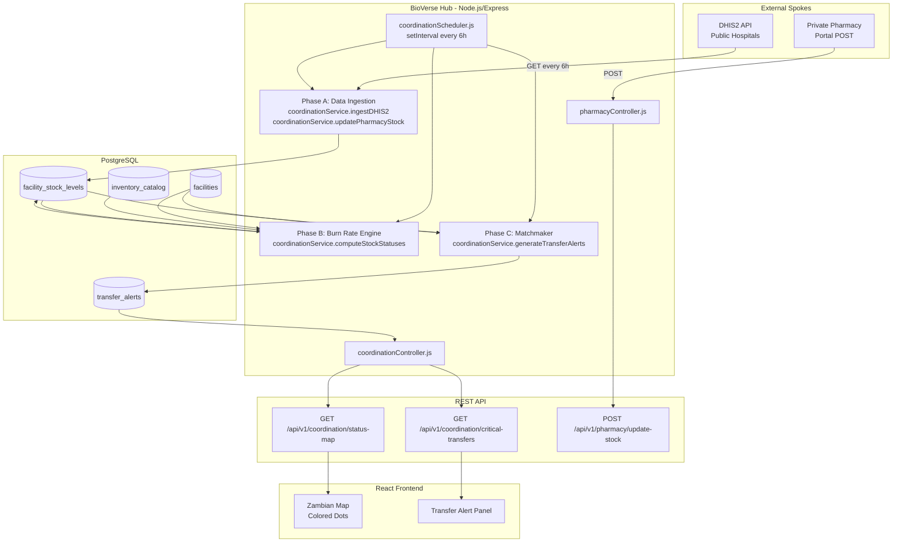
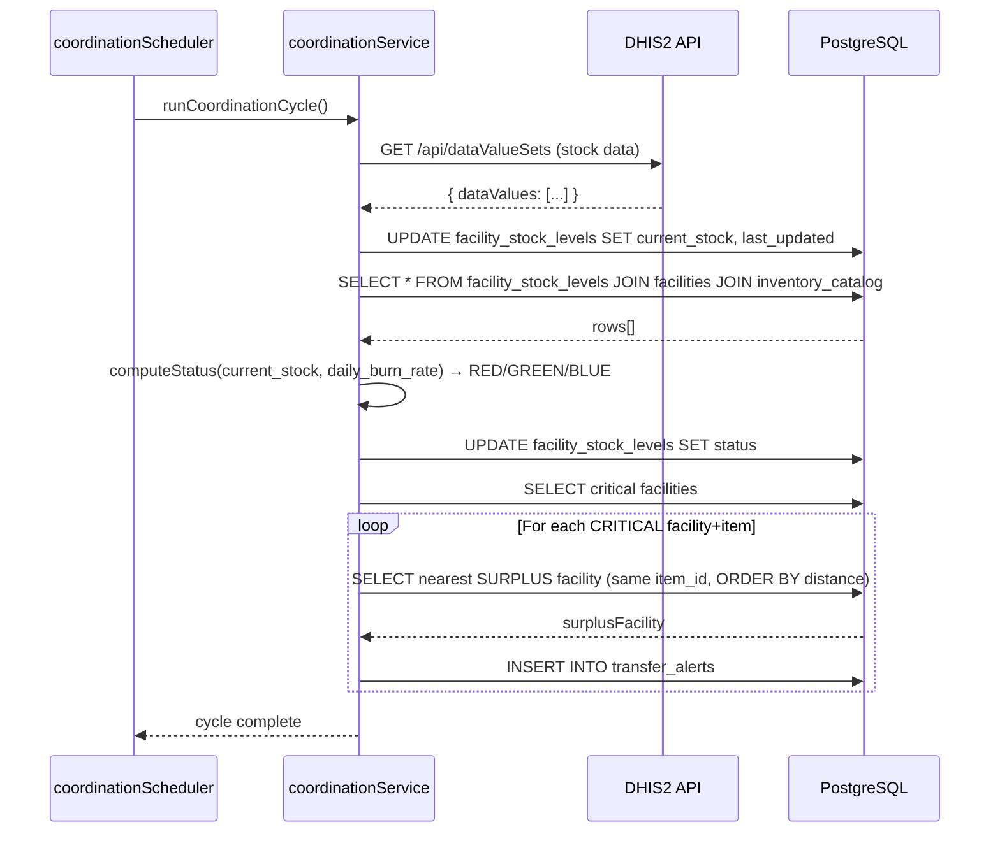
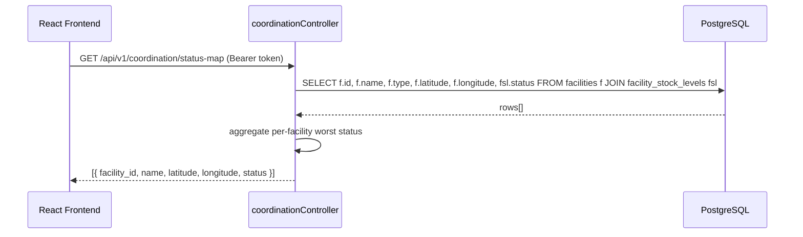
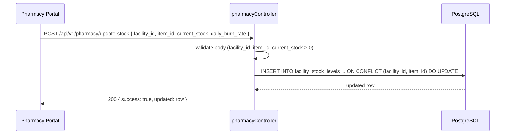

# Design Document: BioVerse Coordination Engine

## Overview

The BioVerse Coordination Engine is a CRON-driven backend subsystem that continuously ingests medical supply data from DHIS2 and private pharmacies, calculates per-facility stock status (CRITICAL / HEALTHY / SURPLUS), and spatially matches critical stockouts with nearby surplus facilities to generate actionable transfer alerts. It exposes three REST API endpoints consumed by the React Ministry of Health dashboard and pharmacy portals.

The engine integrates into the existing Node.js/Express backend (`server/src/`) using the established patterns: `pg` pool from `server/src/config/database.js`, `authenticateToken` / `authorizeRoles` middleware, and the `setInterval`-based scheduler pattern already used by `maternalHealthScheduler.js`. The Haversine distance formula already present in `routingService.js` is reused for spatial matching.

---

## Architecture



---

## Sequence Diagrams

### Phase A–C: CRON Cycle (Every 6 Hours)



### GET /api/v1/coordination/status-map



### POST /api/v1/pharmacy/update-stock



---

## Components and Interfaces

### coordinationService.js

**Purpose**: Core business logic — ingestion, burn-rate computation, spatial matchmaking.

**Interface**:
```javascript
// server/src/services/coordinationService.js

async function ingestDHIS2StockLevels(): Promise<void>
// Fetches stock data from DHIS2 API and upserts facility_stock_levels

async function updatePharmacyStock(facilityId, itemId, currentStock, dailyBurnRate): Promise<Object>
// Upserts a single facility_stock_levels row for a pharmacy push

async function computeStockStatuses(): Promise<void>
// Reads all facility_stock_levels, calculates Days_of_Supply,
// writes status ('CRITICAL'|'HEALTHY'|'SURPLUS') back to each row

async function generateTransferAlerts(): Promise<void>
// For each CRITICAL row, finds nearest SURPLUS facility (same item_id)
// using Haversine, inserts into transfer_alerts

async function runCoordinationCycle(): Promise<void>
// Orchestrates: ingestDHIS2 → computeStatuses → generateAlerts

function computeStatus(currentStock, dailyBurnRate): 'CRITICAL' | 'HEALTHY' | 'SURPLUS'
// Pure function: Days_of_Supply = currentStock / dailyBurnRate
// < 3 → CRITICAL, 3–30 → HEALTHY, > 30 → SURPLUS
```

**Responsibilities**:
- Own all database writes to `facility_stock_levels` and `transfer_alerts`
- Reuse `haversineDistance` from `routingService.js` for spatial queries
- Handle DHIS2 API errors gracefully (log and continue, do not crash cycle)

---

### coordinationController.js

**Purpose**: Express request handlers for the two coordination read endpoints.

**Interface**:
```javascript
// server/src/controllers/coordinationController.js

async function getStatusMap(req, res): Promise<void>
// GET /api/v1/coordination/status-map
// Returns array of facilities with their worst current status

async function getCriticalTransfers(req, res): Promise<void>
// GET /api/v1/coordination/critical-transfers
// Returns open transfer_alerts joined with facility and item data
```

---

### pharmacyController.js

**Purpose**: Express request handler for the pharmacy stock push endpoint.

**Interface**:
```javascript
// server/src/controllers/pharmacyController.js

async function updateStock(req, res): Promise<void>
// POST /api/v1/pharmacy/update-stock
// Validates body, delegates to coordinationService.updatePharmacyStock
```

---

### coordinationScheduler.js

**Purpose**: Bootstraps the 6-hour CRON loop using `setInterval`, mirroring `maternalHealthScheduler.js`.

**Interface**:
```javascript
// server/src/services/coordinationScheduler.js

function startCoordinationScheduler(): void
// Runs runCoordinationCycle() once on startup, then every 6 hours
```

---

### Routes

```
server/src/routes/coordination.js   → GET /status-map, GET /critical-transfers
server/src/routes/pharmacy.js       → POST /update-stock
```

Both registered in `server/src/routes/index.js`:
```javascript
router.use('/v1/coordination', coordinationRoutes);
router.use('/v1/pharmacy', pharmacyRoutes);
```

---

## Data Models

### New Table: `facilities`

```sql
CREATE TABLE IF NOT EXISTS facilities (
  id          SERIAL PRIMARY KEY,
  name        VARCHAR(255) NOT NULL,
  type        VARCHAR(50)  NOT NULL CHECK (type IN ('PUBLIC_HOSPITAL','RURAL_CLINIC','PRIVATE_PHARMACY')),
  latitude    DOUBLE PRECISION NOT NULL,
  longitude   DOUBLE PRECISION NOT NULL
);
```

### New Table: `inventory_catalog`

```sql
CREATE TABLE IF NOT EXISTS inventory_catalog (
  id          SERIAL PRIMARY KEY,
  item_name   VARCHAR(255) NOT NULL,
  category    VARCHAR(50)  NOT NULL CHECK (category IN ('MEDICATION','HARDWARE','BLOOD'))
);
```

### New Table: `facility_stock_levels`

```sql
CREATE TABLE IF NOT EXISTS facility_stock_levels (
  id              SERIAL PRIMARY KEY,
  facility_id     INTEGER NOT NULL REFERENCES facilities(id) ON DELETE CASCADE,
  item_id         INTEGER NOT NULL REFERENCES inventory_catalog(id) ON DELETE CASCADE,
  current_stock   INTEGER NOT NULL DEFAULT 0,
  daily_burn_rate FLOAT   NOT NULL DEFAULT 1,
  status          VARCHAR(10) DEFAULT 'HEALTHY' CHECK (status IN ('CRITICAL','HEALTHY','SURPLUS')),
  last_updated    TIMESTAMP NOT NULL DEFAULT NOW(),
  UNIQUE (facility_id, item_id)
);
```

### New Table: `transfer_alerts`

```sql
CREATE TABLE IF NOT EXISTS transfer_alerts (
  id                  SERIAL PRIMARY KEY,
  alert_id            VARCHAR(20) NOT NULL UNIQUE,  -- e.g. 'TRN-992'
  item_id             INTEGER NOT NULL REFERENCES inventory_catalog(id),
  from_facility_id    INTEGER NOT NULL REFERENCES facilities(id),
  to_facility_id      INTEGER NOT NULL REFERENCES facilities(id),
  surplus_amount      INTEGER NOT NULL,
  distance_km         FLOAT NOT NULL,
  shortage_timeframe  VARCHAR(50),                  -- e.g. '48 Hours'
  status              VARCHAR(20) DEFAULT 'OPEN' CHECK (status IN ('OPEN','ACKNOWLEDGED','RESOLVED')),
  created_at          TIMESTAMP NOT NULL DEFAULT NOW()
);
```

**Validation Rules**:
- `current_stock` must be ≥ 0
- `daily_burn_rate` must be > 0 (prevents division by zero in Days_of_Supply)
- `facility_id` + `item_id` pair is unique in `facility_stock_levels` (UPSERT on conflict)
- `alert_id` generated as `TRN-{transfer_alerts.id}` after insert

---

## Algorithmic Pseudocode

### Phase B: computeStatus (Pure Function)

```pascal
FUNCTION computeStatus(currentStock, dailyBurnRate)
  INPUT:  currentStock    INTEGER  (>= 0)
          dailyBurnRate   FLOAT    (> 0)
  OUTPUT: status          STRING   ('CRITICAL' | 'HEALTHY' | 'SURPLUS')

  PRECONDITION: dailyBurnRate > 0
  PRECONDITION: currentStock >= 0

  daysOfSupply ← currentStock / dailyBurnRate

  IF daysOfSupply < 3 THEN
    RETURN 'CRITICAL'
  ELSE IF daysOfSupply <= 30 THEN
    RETURN 'HEALTHY'
  ELSE
    RETURN 'SURPLUS'
  END IF

  POSTCONDITION: result ∈ { 'CRITICAL', 'HEALTHY', 'SURPLUS' }
END FUNCTION
```

**Preconditions:**
- `dailyBurnRate > 0` — enforced at DB level and validated on pharmacy POST
- `currentStock >= 0` — enforced at DB level

**Postconditions:**
- Returns exactly one of three string literals
- No side effects; pure function safe to unit test in isolation

**Loop Invariants:** N/A (no loops)

---

### Phase B: computeStockStatuses (Batch)

```pascal
ALGORITHM computeStockStatuses
  INPUT:  (reads from facility_stock_levels)
  OUTPUT: (writes status column back to facility_stock_levels)

  rows ← SELECT id, current_stock, daily_burn_rate FROM facility_stock_levels

  FOR EACH row IN rows DO
    ASSERT row.daily_burn_rate > 0
    newStatus ← computeStatus(row.current_stock, row.daily_burn_rate)
    UPDATE facility_stock_levels SET status = newStatus WHERE id = row.id
  END FOR

  POSTCONDITION: ∀ row ∈ facility_stock_levels, row.status ∈ { 'CRITICAL', 'HEALTHY', 'SURPLUS' }
```

**Loop Invariants:**
- All previously processed rows have a valid status value
- No row is left with a NULL status after the loop completes

---

### Phase C: generateTransferAlerts (Spatial Matchmaker)

```pascal
ALGORITHM generateTransferAlerts
  INPUT:  (reads from facility_stock_levels JOIN facilities)
  OUTPUT: (inserts rows into transfer_alerts)

  criticalRows ← SELECT fsl.*, f.latitude, f.longitude, f.name
                 FROM facility_stock_levels fsl
                 JOIN facilities f ON fsl.facility_id = f.id
                 WHERE fsl.status = 'CRITICAL'

  FOR EACH critical IN criticalRows DO
    surplusRows ← SELECT fsl.*, f.latitude, f.longitude, f.name
                  FROM facility_stock_levels fsl
                  JOIN facilities f ON fsl.facility_id = f.id
                  WHERE fsl.status = 'SURPLUS'
                    AND fsl.item_id = critical.item_id

    IF surplusRows IS EMPTY THEN
      CONTINUE  -- No match available; skip
    END IF

    // Find nearest surplus using Haversine
    nearest ← surplusRows[0]
    minDist ← haversineDistance(critical.lat, critical.lng, nearest.lat, nearest.lng)

    FOR EACH surplus IN surplusRows DO
      dist ← haversineDistance(critical.lat, critical.lng, surplus.lat, surplus.lng)
      IF dist < minDist THEN
        minDist ← dist
        nearest ← surplus
      END IF
    END FOR

    shortageHours ← ROUND(critical.current_stock / critical.daily_burn_rate * 24)
    timeframe ← shortageHours || ' Hours'

    INSERT INTO transfer_alerts
      (item_id, from_facility_id, to_facility_id, surplus_amount, distance_km, shortage_timeframe, status)
    VALUES
      (critical.item_id, nearest.facility_id, critical.facility_id,
       nearest.current_stock, minDist, timeframe, 'OPEN')
    ON CONFLICT DO NOTHING  -- Idempotent: skip if alert already exists for this pair
  END FOR

  POSTCONDITION: ∀ CRITICAL facility, IF a SURPLUS match exists for the same item_id,
                 THEN an OPEN transfer_alert exists pairing them
```

**Preconditions:**
- `facility_stock_levels.status` has been computed in Phase B before this runs
- `facilities.latitude` and `facilities.longitude` are non-null

**Postconditions:**
- Each CRITICAL+item pair has at most one OPEN alert (idempotent)
- `distance_km` is the minimum Haversine distance among all SURPLUS candidates

**Loop Invariants (inner loop):**
- `nearest` always holds the closest SURPLUS facility seen so far
- `minDist` is always the distance to `nearest`

---

## Key Functions with Formal Specifications

### `computeStatus(currentStock, dailyBurnRate)`

```javascript
function computeStatus(currentStock, dailyBurnRate) {
  // Precondition: dailyBurnRate > 0, currentStock >= 0
  const daysOfSupply = currentStock / dailyBurnRate;
  if (daysOfSupply < 3)  return 'CRITICAL';
  if (daysOfSupply <= 30) return 'HEALTHY';
  return 'SURPLUS';
}
```

**Preconditions:** `dailyBurnRate > 0`, `currentStock >= 0`
**Postconditions:** result ∈ `{'CRITICAL','HEALTHY','SURPLUS'}`
**Side effects:** None

---

### `ingestDHIS2StockLevels()`

```javascript
async function ingestDHIS2StockLevels()
```

**Preconditions:** `DHIS2_API_URL` and `DHIS2_API_TOKEN` env vars are set
**Postconditions:**
- `facility_stock_levels.current_stock` updated for all DHIS2-sourced facilities
- `last_updated` timestamp refreshed
- On DHIS2 API failure: error is logged, function resolves without throwing (cycle continues)

---

### `generateTransferAlerts()`

```javascript
async function generateTransferAlerts()
```

**Preconditions:** `computeStockStatuses()` has completed in the same cycle
**Postconditions:**
- For every CRITICAL facility+item with a SURPLUS match: an OPEN `transfer_alert` row exists
- Operation is idempotent — re-running does not create duplicate alerts
- `alert_id` format: `TRN-{id}`

---

### `updatePharmacyStock(facilityId, itemId, currentStock, dailyBurnRate)`

```javascript
async function updatePharmacyStock(facilityId, itemId, currentStock, dailyBurnRate)
```

**Preconditions:**
- `facilityId` references an existing `facilities` row with `type = 'PRIVATE_PHARMACY'`
- `currentStock >= 0`
- `dailyBurnRate > 0`

**Postconditions:**
- `facility_stock_levels` row for `(facilityId, itemId)` is upserted
- `last_updated` is set to `NOW()`
- Returns the updated row

---

## Example Usage

### Status Map Response

```json
[
  { "facility_id": 1, "name": "Lusaka General Hospital", "type": "PUBLIC_HOSPITAL",
    "latitude": -15.4167, "longitude": 28.2833, "status": "SURPLUS" },
  { "facility_id": 2, "name": "Chongwe Rural Health Centre", "type": "RURAL_CLINIC",
    "latitude": -15.3300, "longitude": 28.6800, "status": "CRITICAL" },
  { "facility_id": 3, "name": "PillBox Pharmacy", "type": "PRIVATE_PHARMACY",
    "latitude": -15.4200, "longitude": 28.2900, "status": "HEALTHY" }
]
```

### Critical Transfers Response

```json
{
  "alert_id": "TRN-992",
  "item": "Coartem 20/120mg",
  "action": "TRANSFER_REQUIRED",
  "from_facility": {
    "name": "Lusaka General Hospital",
    "surplus_amount": 450,
    "distance_km": 42
  },
  "to_facility": {
    "name": "Chongwe Rural Health Centre",
    "shortage_timeframe": "48 Hours"
  }
}
```

### Pharmacy Stock Push

```json
// POST /api/v1/pharmacy/update-stock
// Request body:
{
  "facility_id": 3,
  "item_id": 7,
  "current_stock": 120,
  "daily_burn_rate": 4.5
}

// Response 200:
{
  "success": true,
  "updated": {
    "facility_id": 3,
    "item_id": 7,
    "current_stock": 120,
    "daily_burn_rate": 4.5,
    "status": "HEALTHY",
    "last_updated": "2025-01-15T08:30:00.000Z"
  }
}
```

---

## Correctness Properties

1. **Status completeness**: After `computeStockStatuses()` runs, every row in `facility_stock_levels` has a non-null status in `{'CRITICAL','HEALTHY','SURPLUS'}`.

2. **Status accuracy**: For any row where `daily_burn_rate > 0`, `status = 'CRITICAL'` if and only if `current_stock / daily_burn_rate < 3`.

3. **Alert idempotency**: Running `generateTransferAlerts()` N times produces the same set of OPEN alerts as running it once (no duplicates).

4. **Spatial optimality**: For each generated transfer alert, no other SURPLUS facility with the same `item_id` is closer to the CRITICAL facility than `from_facility`.

5. **Pharmacy write isolation**: A `POST /api/v1/pharmacy/update-stock` only modifies the `facility_stock_levels` row for the exact `(facility_id, item_id)` pair in the request body; no other rows are affected.

6. **Division-by-zero safety**: `computeStatus` is never called with `daily_burn_rate <= 0`; this is enforced by DB constraint and input validation.

---

## Error Handling

### DHIS2 API Unavailable

**Condition**: DHIS2 returns non-2xx or times out during Phase A
**Response**: Log error via `logger.error`, skip ingestion for this cycle, proceed to Phase B using last-known stock values
**Recovery**: Next scheduled cycle (6 hours) retries automatically

### Division by Zero (daily_burn_rate = 0)

**Condition**: A `facility_stock_levels` row has `daily_burn_rate = 0`
**Response**: DB CHECK constraint prevents insertion; pharmacy POST returns 400 with validation error
**Recovery**: Pharmacy must resubmit with valid `daily_burn_rate > 0`

### No Surplus Match Found

**Condition**: A CRITICAL facility has no SURPLUS facility with the same `item_id`
**Response**: No alert is generated; the CRITICAL status is still visible on the status-map
**Recovery**: Surfaced to MOH dashboard via status-map; human intervention required

### Invalid Pharmacy POST Body

**Condition**: Missing required fields or `current_stock < 0`
**Response**: 400 with descriptive validation error message
**Recovery**: Client corrects and resubmits

---

## Testing Strategy

### Unit Testing

- `computeStatus()` — boundary values: `daysOfSupply = 2.99`, `3.0`, `30.0`, `30.01`; zero stock; large stock
- `generateTransferAlerts()` — mock DB rows: verify nearest facility selected, verify idempotency
- `ingestDHIS2StockLevels()` — mock axios: verify upsert called with correct params on success; verify graceful skip on 500

### Property-Based Testing

**Property Test Library**: fast-check

- For all `(currentStock ≥ 0, dailyBurnRate > 0)`: `computeStatus` always returns one of three valid strings
- For all valid stock inputs: `daysOfSupply < 3 ↔ status === 'CRITICAL'`
- For any set of facilities: the alert's `distance_km` equals the minimum Haversine distance among all SURPLUS candidates

### Integration Testing

- Full cycle test: seed `facilities`, `inventory_catalog`, `facility_stock_levels` → run `runCoordinationCycle()` → assert `transfer_alerts` rows created correctly
- `GET /api/v1/coordination/status-map` — assert response shape and status values
- `POST /api/v1/pharmacy/update-stock` — assert upsert behavior and 400 on invalid input
- Role-based access: `moh` and `admin` can access coordination endpoints; `pharmacy` role can POST update-stock; `health_worker` is denied

---

## Performance Considerations

- The `computeStockStatuses` batch update processes all `facility_stock_levels` rows in a single SELECT + per-row UPDATE. For Zambia's scale (hundreds of facilities), this is acceptable. If the table grows to tens of thousands of rows, migrate to a single `UPDATE ... SET status = CASE WHEN ...` statement.
- The spatial matchmaker performs an in-memory Haversine scan (O(n) per critical facility). A PostGIS `ST_Distance` index would be the upgrade path for large datasets.
- The 6-hour CRON interval means status-map data is at most 6 hours stale. The `last_updated` timestamp is exposed in the API so the frontend can display data freshness.
- `transfer_alerts` should be indexed on `(to_facility_id, status)` for fast critical-transfers queries.

---

## Security Considerations

- `GET /api/v1/coordination/status-map` — requires `authenticateToken`; accessible to roles: `admin`, `moh`, `health_worker`
- `GET /api/v1/coordination/critical-transfers` — requires `authenticateToken`; accessible to roles: `admin`, `moh`
- `POST /api/v1/pharmacy/update-stock` — requires `authenticateToken`; restricted to `pharmacy` role only
- DHIS2 API token stored in `DHIS2_API_TOKEN` environment variable; never logged or exposed in responses
- All DB queries use parameterized statements via the existing `pg` pool — no SQL injection surface

---

## Dependencies

- **Existing** — `pg` pool (`server/src/config/database.js`), `authenticateToken`/`authorizeRoles` (`server/src/middleware/auth.js`), `haversineDistance` logic (`server/src/services/routingService.js`), `logger` (`server/src/services/logger.js`)
- **New env vars** — `DHIS2_API_URL`, `DHIS2_API_TOKEN`
- **No new npm packages required** — `axios` already present in the project for DHIS2 HTTP calls
