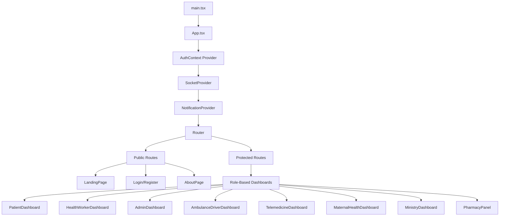

# 🔄 BioVerse Component Flow & Relationships

## 🏗️ Application Architecture Flow



## 🎯 Context & Hook Relationships

```
┌─────────────────────────────────────────────────────────────┐
│                    CONTEXT PROVIDERS                        │
├─────────────────────────────────────────────────────────────┤
│  AuthContext          SocketContext       NotificationContext│
│       │                     │                        │      │
│       ▼                     ▼                        ▼      │
│  useAuth()            useSocket()            useNotifications()
│                                                             │
└─────────────────────────────────────────────────────────────┘
                               │
                               ▼
┌─────────────────────────────────────────────────────────────┐
│                      COMPONENTS                             │
├─────────────────────────────────────────────────────────────┤
│                                                             │
│  🏥 Dashboard Components                                    │
│  ├── PatientDashboard          ├── TelemedicineDashboard    │
│  ├── HealthWorkerDashboard     ├── MaternalHealthDashboard  │
│  ├── AdminDashboard            ├── MinistryDashboard        │
│  ├── AmbulanceDriverDashboard  └── PharmacyPanel           │
│                                                             │
│  🧩 Shared Components                                       │
│  ├── NotificationSystem        ├── VideoCall                │
│  ├── HealthTwin Components     ├── LumaChatbot             │
│  ├── ClinicLocator            └── SRHSymptomChecker        │
│                                                             │
└─────────────────────────────────────────────────────────────┘
```

## 🚑 Emergency Services Flow

```
AmbulanceDriverDashboard
├── useSocket() ──────────────┐
├── Emergency Alert Display   │
├── Driver Status Control     │
└── Patient Details          │
                             │
Emergency Alert Lifecycle:   │
                             │
┌─────────────────────────────▼─────────────────────────────┐
│                    SOCKET EVENTS                          │
│  'emergency:new' ────────────▶ Display Alert             │
│  'emergency:critical' ───────▶ Priority Alert            │
│  'emergency:acknowledged' ───▶ Remove from Queue         │
│  'driver:status:update' ─────▶ Update Driver Status      │
└───────────────────────────────────────────────────────────┘
```

## 🏥 Telemedicine Flow

```
TelemedicineDashboard
├── useCallback(fetchTelemedicineData) ──┐
├── Consultation Management              │
├── Remote Monitoring                    │
├── AI Insights                          │
└── Analytics                            │
                                         │
Data Flow:                               │
┌─────────────────────────────────────────▼─────────────┐
│               API INTEGRATION                          │
│  /api/telemedicine/consultations ──▶ Consultation[]   │
│  /api/telemedicine/monitoring ─────▶ MonitoringSession[]│
│  Real-time Updates ────────────────▶ Socket Events    │
└───────────────────────────────────────────────────────┘
```

## 🔔 Notification System Flow

```
NotificationSystem Components:
┌──────────────────────────────────────────────────────────┐
│  NotificationProvider                                     │
│  ├── NotificationContext ──────────────▶ Global State   │
│  ├── addNotification()                                   │
│  ├── removeNotification()                                │
│  └── clearAll()                                          │
│                                                          │
│  Components Using Notifications:                        │
│  ├── NotificationBell ──────────▶ Header Dropdown       │
│  ├── ToastNotifications ────────▶ Floating Alerts       │
│  └── Dashboard Components ──────▶ Health Alerts         │
└──────────────────────────────────────────────────────────┘

Notification Types:
├── 'health_alert' ─────▶ Critical health events
├── 'warning' ──────────▶ Important reminders  
├── 'info' ─────────────▶ General information
├── 'success' ──────────▶ Positive outcomes
└── 'error' ────────────▶ System errors
```

## 🤖 Health Twin System

```
HealthTwin Components:
┌──────────────────────────────────────────────────────────┐
│  HealthTwinDashboard (Main Hub)                          │
│  ├── HealthTwinOverview ────▶ Patient Summary            │
│  ├── CarePlanTracking ─────▶ Treatment Plans            │
│  ├── MedicationManagement ──▶ Drug Interactions         │
│  ├── LabResults ────────────▶ Test Results              │
│  └── RiskAssessment ────────▶ AI Risk Analysis          │
│                                                          │
│  Data Sources:                                           │
│  ├── healthTwinService.ts ──▶ API Integration           │
│  ├── useHealthTwin() ───────▶ State Management          │
│  └── Real-time Updates ─────▶ WebSocket Events          │
└──────────────────────────────────────────────────────────┘
```

## 🔄 State Management Pattern

```
Component State Flow:
┌─────────────────┐    ┌──────────────────┐    ┌─────────────────┐
│  UI Component   │───▶│   Custom Hook    │───▶│  API Service    │
│  (User Action)  │    │  (Business Logic)│    │ (Data Fetching) │
└─────────────────┘    └──────────────────┘    └─────────────────┘
         ▲                       │                        │
         │              ┌────────▼────────┐               │
         │              │  Local State    │               │
         │              │  (useState)     │               │
         │              └─────────────────┘               │
         │                       │                        │
         │              ┌────────▼────────┐               │
         └──────────────│  Global Context │◀──────────────┘
                        │  (Shared State) │
                        └─────────────────┘

Examples:
- useSocket() ──────▶ Real-time connections
- useNotifications() ▶ Global alert system  
- useAuth() ────────▶ User authentication
- useHealthTwin() ──▶ Patient data management
```

## 📱 Responsive Design Structure

```
Layout Hierarchy:
App
├── MainLayout (Legacy)
├── ProtectedRoute ─────▶ Authentication Guard
└── Page Components
    ├── Mobile-First Design
    ├── Tailwind CSS Classes
    ├── Framer Motion Animations
    └── Dark Mode Support

Breakpoints:
├── sm: 640px ────▶ Mobile
├── md: 768px ────▶ Tablet  
├── lg: 1024px ───▶ Desktop
└── xl: 1280px ───▶ Large Desktop
```

## 🔧 Development Tools Integration

```
Build Pipeline:
├── Vite ──────────▶ Fast development server
├── TypeScript ────▶ Type safety
├── ESLint ────────▶ Code quality (0 errors!)
├── Tailwind CSS ──▶ Utility-first styling
└── Hot Reload ────▶ Fast refresh enabled

Production Ready:
├── ✅ Zero Lint Errors
├── ✅ Type-Safe Codebase  
├── ✅ Optimized Bundles
├── ✅ Tree Shaking
└── ✅ Fast Refresh Compatible
```

This architecture provides a solid foundation for a scalable healthcare application with proper separation of concerns, type safety, and maintainable code structure.
